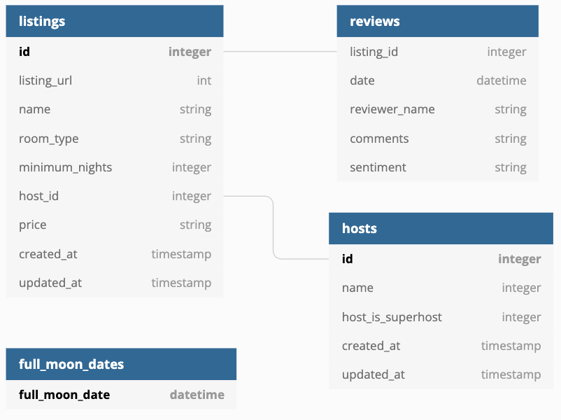

# dbt Data Modeling Project

This project demonstrates the power of **dbt (data build tool)** for data modeling and transformation on **Snowflake** and dashboarding with **Preset**.

## Overview

- **Purpose:** Showcase best practices in data modeling using dbt.
- **Platforms:** Snowflake (data warehouse), Preset (visualization).

## Features

- Source data ingestion and staging
- Transformations using dbt models
- SCD using dbt snapshots
- Incremental appending for large datasets
- Cataloging, documentation and testing of models

## Ingested source schema



## Getting Started

1. **Clone the repository**
2. **Use python venv**
    ```bash
    virtualenv venv
    # Windows
    venv\Scripts\activate 
    # macOS/Linux
    source venv/bin/activate
    ```
3. **Install dbt:**  
    ```bash
    pip install dbt-snowflake==1.9.0
    dbt --version
    ```
4. **Configure Snowflake connection:**  
    Update `profiles.yml` with your Snowflake account name in __dbtlearn__.
5. **Prepare Snowflake users/roles and ingested data:** 
    - [user creation](https://github.com/nordquant/complete-dbt-bootcamp-zero-to-hero/blob/main/_course_resources/course-resources.md#snowflake-user-creation)
    - [data import](https://github.com/nordquant/complete-dbt-bootcamp-zero-to-hero/blob/main/_course_resources/course-resources.md#snowflake-data-import)
6. **Run dbt models:**  
    ```bash
    dbt run
    ```


## Project Structure

- `analyses/` — ad-hoc analysis queries on Snowflake (not materialized).
- `macros/` — custom tests and reusable sql using jinja. 
- `models/` — main dbt models (src, dim, fcts, etc.)
- `snapshots/` — SCD 2 models logic.
- `docs/` — Documentation.

## Final Lineage


## Dashboard with Preset


## Credits

This project was made with the guidance of [Zoltan C. Toth](https://github.com/nordquant/complete-dbt-bootcamp-zero-to-hero/commits?author=zoltanctoth) in his Udemy course [The Complete dbt bootcamp](https://udemy.com/course/complete-dbt-data-build-tool-bootcamp-zero-to-hero-learn-dbt)

---